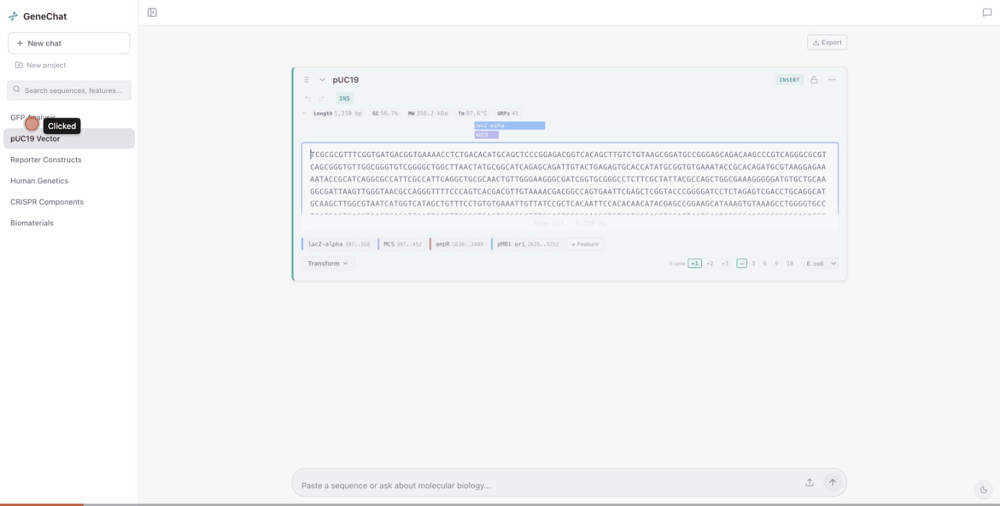
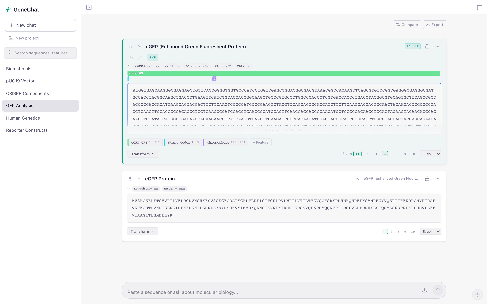
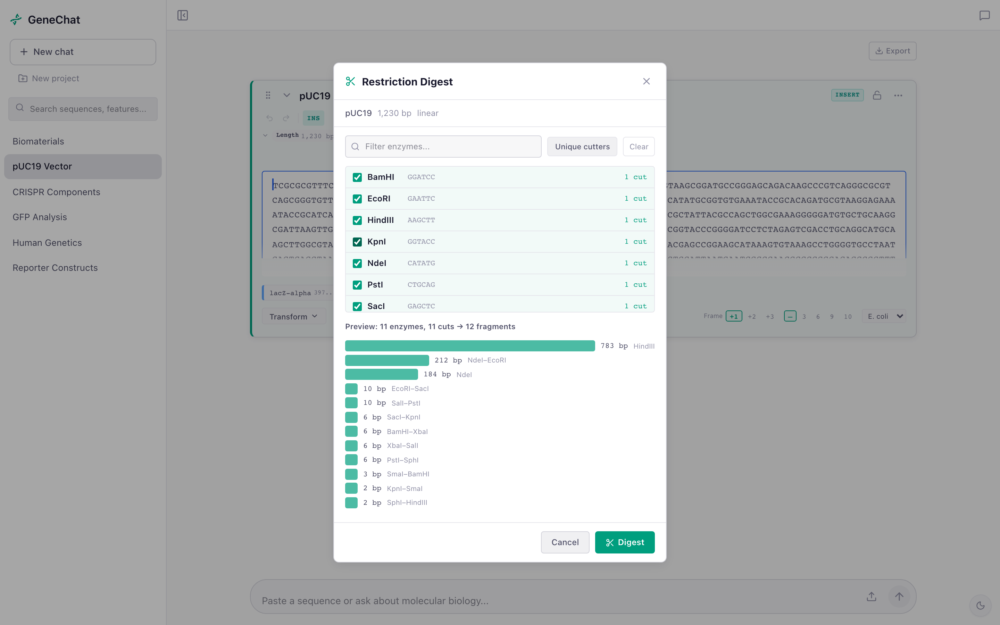
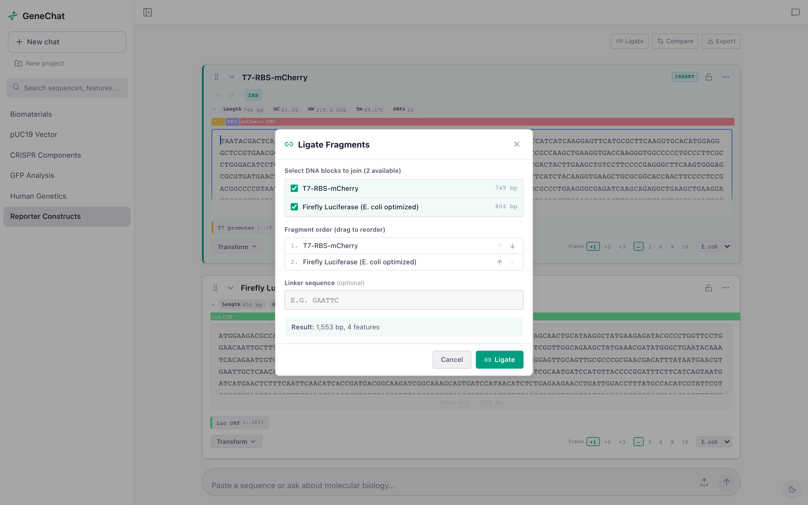
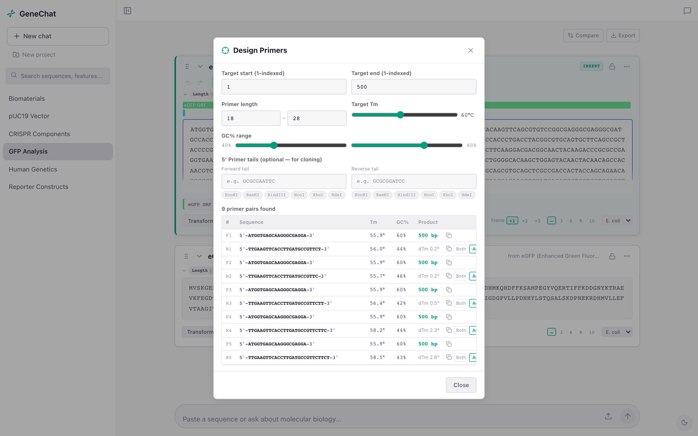
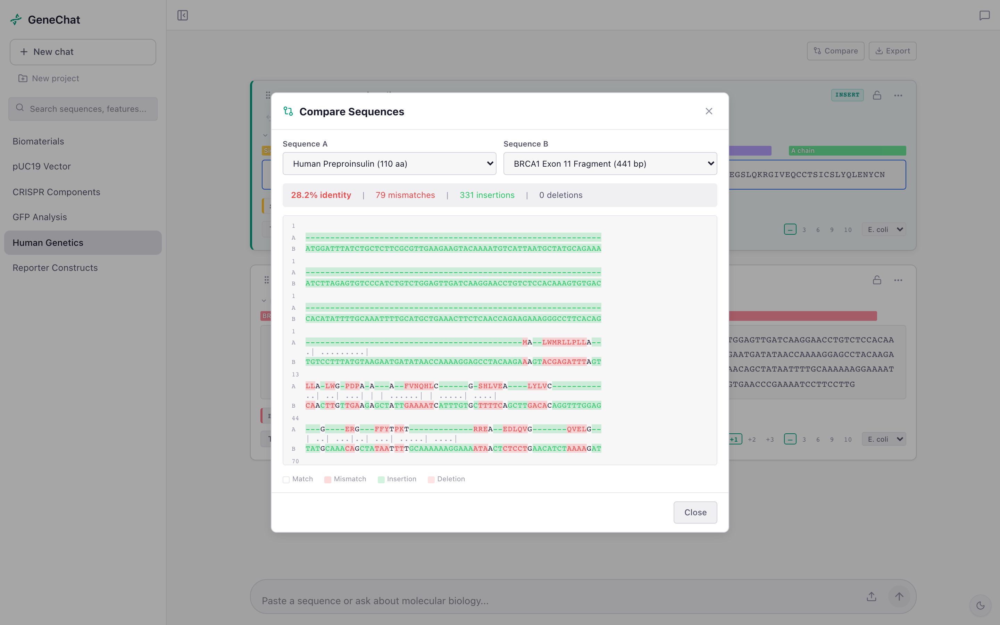
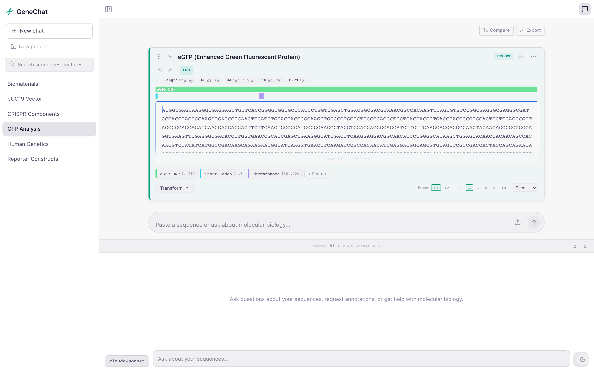

<p align="center">
  
</p>

<p align="center">
  <strong>A browser-based bioinformatics workbench for DNA, RNA, and protein analysis.</strong>
</p>

<p align="center">
  <a href="https://github.com/jvogan/genechat/actions/workflows/ci.yml"></a>
  <a href="LICENSE"></a>
  <a href="https://www.typescriptlang.org/"></a>
  <a href="https://react.dev/"></a>
  
</p>

GeneChat is an open-source sequence analysis tool that runs entirely in your browser. Import GenBank or FASTA files, design primers, run restriction digests, ligate fragments, align sequences, and annotate features — all without sending data to a server. An optional AI assistant (bring your own API key) understands your workspace and can create or modify sequences on your behalf.

<p align="center">
  
</p>

## Features

### Sequence Workspace

Always-editable DNA, RNA, and protein blocks with inline mutation tracking, feature annotations, per-block stats (length, GC%, MW, Tm, ORF count), checkpoints, and drag-to-reorder. Import FASTA and GenBank files via drag-and-drop. Export per-block or per-conversation.

<p align="center"></p>

### Cloning Operations

Restriction digest with 25 built-in enzymes (unique-cutter filter, proportional fragment preview), ligation with linker support, and primer design with Tm/GC tuning and restriction-site tail presets (EcoRI, BamHI, HindIII, NcoI, XhoI, NdeI).

<p align="center"></p>

<p align="center"></p>

<p align="center"></p>

### Sequence Analysis

Needleman-Wunsch pairwise alignment with color-coded identity/mismatch display, IUPAC-aware motif search (Cmd+F) with match highlighting and navigation, reading frame translation (+1/+2/+3), and selection actions (copy, extract, annotate, stats).

<p align="center"></p>

### AI Assistant

Bring-your-own-key chat drawer supporting Claude, GPT, Gemini, and Kimi. The assistant sees your workspace context and can create blocks, add features, modify sequences, rename blocks, and highlight regions.

Click the key icon in the AI drawer to configure a provider. Get an API key from any supported provider:

- [Anthropic (Claude)](https://console.anthropic.com/)
- [OpenAI](https://platform.openai.com/api-keys)
- [Google (Gemini)](https://aistudio.google.com/apikey)
- [Moonshot (Kimi)](https://platform.moonshot.cn/)

> **Your keys never leave your browser.** They are stored in IndexedDB on your machine — no server, no `.env` file, nothing to accidentally commit. GeneChat has no backend and sends API requests directly from your browser to the provider.

<p align="center"></p>

## Quick Start

Requires [Node.js](https://nodejs.org/) 18 or later.

```bash
git clone https://github.com/jvogan/genechat.git
cd genechat
npm install
npm run dev
```

Open [http://localhost:5180](http://localhost:5180) — works in Chrome, Firefox, Safari, and Edge.

## Commands

| Command | Description |
|---------|-------------|
| `npm run dev` | Start dev server (port 5180) |
| `npm run build` | Production build |
| `npm run lint` | Lint with ESLint |
| `npm run test` | Run unit tests |
| `npm run test:e2e` | Run Playwright E2E tests |

<details>
<summary>Project Structure</summary>

```
src/
  ai/           # AI provider implementations (Claude, GPT, Gemini, Kimi)
  assets/       # Static assets
  bio/          # Pure bioinformatics functions (parsers, transforms, analysis)
  components/   # React UI (sidebar, sequence stack, AI drawer, dialogs)
  constants/    # Feature templates and configuration
  hooks/        # Custom hooks (analysis, feature sync, AI chat)
  persistence/  # Dexie.js IndexedDB schema and Zustand sync
  store/        # Zustand stores (project, sequence, UI, AI state)
e2e/            # Playwright end-to-end tests
```

</details>

## Built With

[React](https://react.dev/) &middot; [TypeScript](https://www.typescriptlang.org/) &middot; [Vite](https://vite.dev/) &middot; [Tailwind CSS](https://tailwindcss.com/) &middot; [Zustand](https://zustand.docs.pmnd.rs/) &middot; [Dexie.js](https://dexie.org/) &middot; [Playwright](https://playwright.dev/)

## Contributing

See [CONTRIBUTING.md](CONTRIBUTING.md) for guidelines.

## Changelog

See [CHANGELOG.md](CHANGELOG.md) for release history.

## Security

See [SECURITY.md](SECURITY.md) for reporting vulnerabilities.

## License

[MIT](LICENSE)
